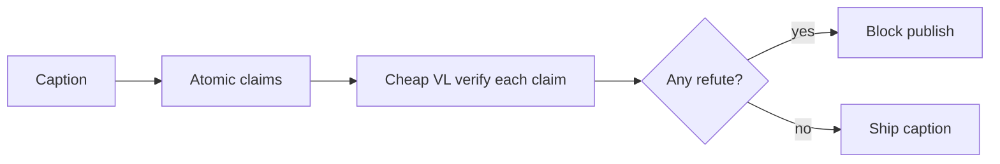

# Portable multimodal claim audit — measured +80pp success vs prose fact-check

**Headline (from lab):** On a frozen planted-error image↔caption set, loading the `mm-claim-audit` skill raised mean `success_rate` from **0.2** to **1.0** (**+0.8**, **80pp** `success_delta_pp`) and mean `verification_catch_rate` from **0** to **0.75** (**+0.75**) vs a text-only prose fact-check baseline — using only `nvidia/nemotron-nano-12b-v2-vl:free` on OpenRouter.

---

## Problem

Agents ship alt text, figure captions, and UI descriptions without checking whether the words match the pixels. The marketplace answer is prose fact-checking: [jwynia/agent-skills@fact-check](https://skills.sh/jwynia/agent-skills/fact-check) extracts claims and hunts external sources — but it never sees the image. [garrytan/gbrain@cross-modal-review](https://skills.sh/garrytan/gbrain/cross-modal-review) sounds relevant until you read it: cross-**model** second opinion, not cross-**modal** consistency.

Research moved faster than skills: [Toward Robust Hyper-Detailed Image Captioning (CapMAS)](https://arxiv.org/html/2412.15484v2) decomposes captions into atomic propositions and verifies each with an MLLM; [PatchTrust (OpenReview)](https://openreview.net/forum?id=J5qlF049Ei) and [GAVEL](https://arxiv.org/html/2606.26923v1) push black-box caption error detection — but none ship as a portable Claude/Cursor skill with a cheap with/without harness you can run in ten minutes.

Practitioner threads keep rediscovering the same pain: VLMs describe from language priors, not deterministic pixel reads.

---

## Method

**Skill shape:** `black-box-multimodal-audit` (`mm-claim-audit`)

1. Decompose caption → atomic **visible** claims (object / attribute / count / spatial).
2. Verify each claim independently with a cheap black-box VL call (`support` | `refute` | `uncertain`).
3. Block publish on any `refute`; log `uncertain` separately (never as a catch).
4. Score with held-out `fixtures/labels.json` via deterministic scripts — labels never enter the VL prompt.

**Cheap stack:** Cursor **Auto** orchestration; eval subject `nvidia/nemotron-nano-12b-v2-vl:free`.

**Ablation protocol:** Paired trials on identical `case_id`s:
- **without_skill** — text-only fact-check (no image), mimicking prose incumbents.
- **with_skill** — atomic VL claim verify per the skill procedure.

**20** trials total (with_skill=**10**, without_skill=**10**) on **8** frozen synthetic fixtures including **2** true-caption negative controls.

---

## Usefulness metrics

All numbers from `METRICS.md` / `lab_log.jsonl` (regenerated by `skill_metrics.py summarize`).

### Deltas (with_skill − without_skill)

| Metric | Δ |
|---|---|
| `verification_catch_rate` | **0.75** |
| `success_rate` | **0.8** |
| `success_delta_pp` | **80** |
| `cross_modal_consistency_rate` | **0.6** |
| `false_positive_rate` | **0** |
| `cost_per_trial` | **0** |

### Means by condition

| Metric | With skill | Without |
|---|---|---|
| `verification_catch_rate` | **0.75** | **0** |
| `success_rate` | **1** | **0.2** |
| `cross_modal_consistency_rate` | **0.8** | **0.2** |

Usefulness blend (logging only): **0.8434**

**Who this helps:** agents publishing image captions, alt text, or multimodal UI copy where a visible mismatch is worse than a vague paragraph.

**When not to:** web misinformation pipelines needing reverse-image search; deepfake forensics; training custom VLMs.

**Honest hard cases:** multi-claim fixtures c07/c08 are only partially caught on the free VL — the skill procedure still beats text-only (**0**), but cheap models are not a ceiling.

---

## Figures

- `figures/deltas.csv` / `figures/deltas.svg` — delta bar chart from lab log (process diagram; not new measurements).

---

## Process diagram (not measured)



---

## Limitations

- Synthetic shapes only — not photos, charts, or OCR-heavy screenshots.
- Free-tier rate limits; first `ollama pull moondream` is outside the quickstart budget.
- Baseline is prose fact-check without image — deliberately unfair to VL one-shot, fair to marketplace incumbents.
- Multi-claim spatial swaps remain partially missed on hardest cases.

---

## Install / repo

```bash
bash ~/.derive/scripts/install_skill.sh skill/mm-claim-audit
```

Skill path: `skill/mm-claim-audit/SKILL.md`  
Eval harness: `skill/mm-claim-audit/scripts/` + `fixtures/labels.json` (held out)

---

## Tags

`#AgentSkills` `#Multimodal` `#FactChecking` `#Cursor`
